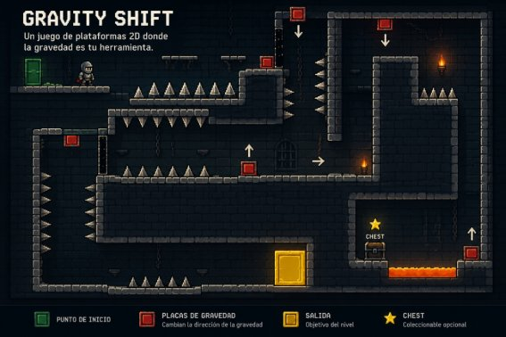
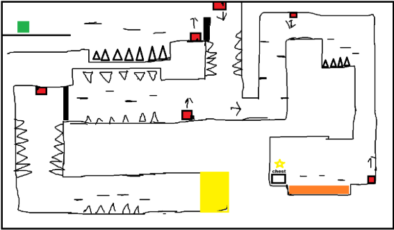

**GAME DESIGN DOCUMENT**

**Nombre del Juego**

**Gravity Shift**

**Versión:** 0.0.1

**Fecha de actualización:** 19/7/2026

**Ficha del Grupo**

|**Apellido y Nombre Completo**|**Función dentro del grupo**|
| :- | :- |
|Lautaro Oldani|Game Designer / Level Designer / Programmer|

1. **High Concept y Visión Inicia**

   **Concept art generado durante la etapa de preproducción que representa la ambientación y el estilo visual propuesto para Gravity Shift.**

## **2. Estructura Core del Proyecto**
**2.1 Objetivo del Proyecto**\

Desarrollar un videojuego de plataformas 2D centrado en una mecánica de cambio de gravedad mediante placas distribuidas por los niveles. El objetivo es crear una experiencia donde el diseño de niveles sea el principal desafío, obligando al jugador a utilizar la gravedad para superar obstáculos y avanzar hasta la salida de la mazmorra.\

**2.2 Diseño e Investigación\
Definición de la idea**

Gravity Shift es un juego de plataformas 2D donde el jugador controla a un caballero atrapado en una antigua mazmorra. Para escapar deberá utilizar placas especiales que modifican la gravedad, permitiéndole caminar por paredes y techos para superar distintos desafíos.\

**Género**

- Plataformas 2D 
- Puzzle 
- Precisión 

**Referencias**

- **VVVVVV** → Cambio de gravedad. 
- **Celeste** → Diseño de niveles y progresión. 
- **Portal 2** → Introducción gradual de una mecánica. 

**Público objetivo**

Gravity Shift está orientado a jugadores de PC que disfrutan los juegos de plataformas y resolución de desafíos. Está dirigido principalmente a adolescentes y adultos jóvenes interesados en experiencias donde el diseño de niveles y una mecánica innovadora sean el principal atractivo.

**Mecánicas principales**

- Movimiento lateral. 
- Salto. 
- Cambio de gravedad mediante placas. 
- Exploración. 
- Resolución de obstáculos.

**2.3 Concepto del Juego**

El jugador despierta dentro de una antigua mazmorra sin conocer cómo llegó allí. Para escapar deberá atravesar distintas salas repletas de obstáculos utilizando placas que alteran la gravedad. A medida que avance, los niveles introducirán nuevos desafíos y combinaciones de gravedad que pondrán a prueba la capacidad del jugador para adaptarse al entorno.

**2.4 Premisas del Videojuego**

- El cambio de gravedad será la mecánica principal del juego. 
- El diseño de niveles estará construido alrededor de esta mecánica. 
- El jugador deberá utilizar obligatoriamente las placas para avanzar. 
- La dificultad aumentará progresivamente mediante nuevas combinaciones de obstáculos y cambios de gravedad. 
- El combate no será el eje principal de la experiencia.** 

**2.5 Condiciones del Desarrollo**

- Motor gráfico: Godot Engine. 
- Lenguaje: GDScript. 
- Desarrollo individual. 
- Control de versiones mediante Git. 
- Assets gratuitos. 
- Tiempo estimado de desarrollo: cinco meses. 

**2.6 Alcance del Proyecto**

El proyecto se desarrollará en distintas etapas. La primera versión consistirá en un prototipo funcional independiente de los niveles finales, cuyo objetivo será probar y validar la mecánica principal de cambio de gravedad mediante placas.

**Primera versión: Prototipo funcional**

**El prototipo incluirá:**

- Movimiento básico del caballero. 
- Sistema de cambio de gravedad. 
- Placas rojas para cambiar la gravedad entre arriba y abajo. 
- Placas azules para cambiar la gravedad entre izquierda y derecha. 
- Plataformas y obstáculos. 
- Interacción entre el personaje y las diferentes orientaciones de gravedad. 
- Un nivel de prueba compuesto por distintas secciones para experimentar con la mecánica. 
- Una condición de finalización del nivel de prueba. 

El nivel de prueba no formará parte necesariamente de los niveles finales del juego. Su función será permitir comprobar el funcionamiento de la mecánica principal y evaluar las posibilidades de diseño de niveles antes de comenzar el desarrollo de los niveles definitivos.

**Versión final prevista**

Una vez validada la mecánica principal, se desarrollarán los niveles definitivos del juego. El alcance previsto incluye:

- Aproximadamente cinco niveles. 
- Diseño de niveles basado en la utilización de las placas de gravedad. 
- Cofres que contienen las llaves necesarias para avanzar. 
- Barreras que bloquean el acceso a determinadas zonas. 
- Obstáculos y peligros. 
- Menú principal. 
- Pantallas de victoria y derrota. 
- Música y efectos de sonido. 
- Mejoras visuales y de ambientación. 

El proyecto se centrará principalmente en la mecánica de cambio de gravedad y en el diseño de niveles, evitando incorporar sistemas secundarios que aumenten innecesariamente el alcance del desarrollo.

# 3\. Diseño Detallado del Juego
**3.1 Elementos del Juego**\

|**Elemento**|**Tipo**|**Descripción**|
| :- | :- | :- |
|Caballero|Personaje|Personaje controlado por el jugador. Debe escapar de la mazmorra utilizando las placas de gravedad.|
|Placas de gravedad|Mecánica|Modifican la gravedad al ser activadas. Placa Roja: arriba/abajo. Placa Azul: izquierda/derecha.|
|Plataformas|Escenario|Superficies por las que se desplaza el jugador.|
|Obstáculos|Escenario|Peligros que dificultan el avance, como pinchos o vacíos.|
|Cofre|Objeto|Contiene la llave necesaria para continuar el nivel.|
|Llave|Objeto|Permite desbloquear la barrera que protege la salida.|
|Barrera|Escenario|Bloquea el acceso a la salida hasta obtener la llave.|
|Salida|Objetivo|Punto final del nivel al que se accede una vez abierta la barrera.|

**3.2 Reglas**

|**Regla**|**Descripción**|
| :- | :- |
|Inicio del nivel|El jugador comienza cada nivel en un punto de inicio predeterminado dentro de la mazmorra.|
|Movimiento|El jugador puede desplazarse hacia la izquierda y derecha, además de saltar para superar obstáculos.|
|Cambio de gravedad|Al activar una placa de gravedad, la orientación de la gravedad cambia inmediatamente según el tipo de placa.|
|Placa azul|Cambia la gravedad entre izquierda y derecha.|
|Placa roja|Cambia la gravedad entre arriba y abajo.|
|Obstáculos|Si el jugador toca un obstáculo peligroso (como pinchos) o cae al vacío, deberá reiniciar el nivel.|
|Obtención de la llave|El jugador deberá abrir el cofre para conseguir la llave necesaria para desbloquear la barrera.|
|Barrera|La barrera permanecerá cerrada hasta que el jugador obtenga la llave correspondiente.|
|Victoria|El nivel se completa cuando el jugador atraviesa la salida después de abrir la barrera.|
|Derrota|El jugador pierde al tocar un obstáculo mortal o caer fuera del escenario, reiniciando el nivel.|

**3.3 Descripción de una sesión de juego**

El jugador inicia el nivel controlando al caballero en la entrada de la mazmorra. A medida que avanza, deberá superar plataformas y obstáculos utilizando las placas para cambiar la gravedad. Durante el recorrido encontrará un cofre que contiene la llave necesaria para desbloquear la barrera que protege la salida. Una vez obtenida la llave y abierta la barrera, podrá llegar a la salida y completar el nivel.\

**3.4 Estética y Experiencia del Jugador**

Gravity Shift busca transmitir una sensación de exploración, desafío y superación. A medida que el jugador avanza por la mazmorra, deberá observar cuidadosamente el entorno y utilizar la mecánica de cambio de gravedad para resolver los distintos desafíos. La dificultad aumentará de forma progresiva, incentivando el aprendizaje constante y la satisfacción de superar cada nivel.\

**Estética visual**

- Ambientación medieval. 
- Mazmorra antigua. 
- Iluminación tenue. 
- Plataformas de piedra. 
- Placas de gravedad con colores llamativos para facilitar su identificación. 

**Experiencia buscada**

- Curiosidad. 
- Desafío. 
- Satisfacción al resolver cada nivel. 
- Aprendizaje progresivo de la mecánica

#
# 4\. Arte, Audio y Bocetos
**Bocetos de Pantalla / UI**\
Boceto del primer nivel donde se representa la distribución aproximada de plataformas, placas de gravedad, obstáculos, cofre, barrera y salida.\

****

**Estilo Visual y Sonoro**

Visual:

- Pixel Art 2D. 
- Ambientación medieval. 
- Mazmorras de piedra. 
- Colores oscuros con elementos importantes resaltados mediante colores vivos (placas, llaves y salida). 

Sonoro:

- Música ambiental de fantasía. 
- Efectos para: 
  - salto; 
  - cambio de gravedad; 
  - apertura del cofre; 
  - obtención de la llave; 
  - apertura de la barrera; 
  - completar el nivel.

